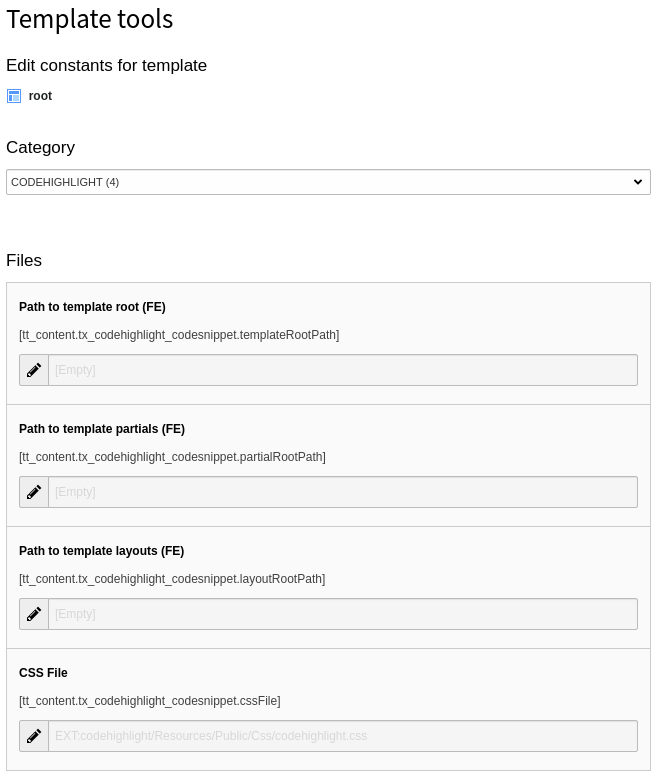

.. include:: ../Includes.txt

.. _configuration:

=============
Configuration
=============

Target group: **Developers, Integrators**

.. _site-configuration:

Site Configuration
==================

Some site-wide configurations can be made in the Site Configuration. Select a
site under :guilabel:`Site Management` > :guilabel:`Sites` and switch to the tab
:guilabel:`Code Highlight`.

.. figure:: ../Images/Configuration/site-configuration.png
   :class: with-shadow
   :alt: Site Configuration

   Site Configuration

.. _configuration-theme:

CSS File for Theme
------------------

In the value picker you have the choice between several themes for using on a
website. As the extension uses `Prism <https://prismjs.com/>`__ for the code
highlighting you can have a look at their website to see the differences
between the themes.

When selecting a theme, the path to the according CSS file is stored in the site
configuration. You can also use an own theme to customise the look of the
code snippets.

As the theme is assigned to a site, different sites can have different themes.

.. tip::

   If you don't like the shipped themes you find many more in a separate
   `GitHub repository <https://github.com/PrismJS/prism-themes>`__. Just
   download the desired theme, save it to your site package extension and
   type the path to the file into the site configuration field.

.. _configuration-url-hash:

Usage of a URL Hash
-------------------

If the option is activated, the usage of a URL hash (like ``#codesnippet8.5-6``)
for highlighting code and as anchor is available. You can find more information
in the :ref:`chapter for editors <editor-url-hash>`.

.. _configuration-command-line-default-host:

Command Line: Default Host
--------------------------

Defines the default host for the command line, if none is given in the options
of the content element. If a value is neither in the configuration nor in the
content element given, ``localhost`` is used as last fallback.

.. _configuration-command-line-default-user:

Command line: Default User
--------------------------

Defines the default user for the command line, if none is given in the options
of the content element. If a value is neither in the configuration nor in the
content element given, ``user`` is used as last fallback.

.. _constant-editor:

Constant Editor
===============

Some constants can be defined in the
:ref:`Constant Editor <t3tsref:typoscript-syntax-constant-editor>`.

Select the category :guilabel:`Codehighlight` and make your adjustments.

   Constant Editor

Files
-----

If you want to change the layout or template of the content element or add a
partial you can make a copy of then and adjust the Fluid root paths.

Path to template root (FE)
~~~~~~~~~~~~~~~~~~~~~~~~~~

Enter the additional template root path, e.g.
:file:`EXT:your_sitepackage/Resources/Private/Templates/Codehighlight/`.

Alternatively you can change the setting directly in the TypoScript setup:

.. code-block:: typoscript

   tt_content.tx_codehighlight_codesnippet.templateRootPaths {
      10 = EXT:your_sitepackage/Resources/Private/Templates/Codehighlight/
   }

Path to template partials (FE)
~~~~~~~~~~~~~~~~~~~~~~~~~~~~~~

Enter the additional partial root path, e.g.
:file:`EXT:your_sitepackage/Resources/Private/Partials/Codehighlight/`.

Alternatively you can change the setting directly in the TypoScript setup:

.. code-block:: typoscript

   tt_content.tx_codehighlight_codesnippet.partialRootPaths {
      10 = EXT:your_sitepackage/Resources/Private/Partials/Codehighlight/
   }

Path to template layouts (FE)
~~~~~~~~~~~~~~~~~~~~~~~~~~~~~

Enter the additional layout root path, e.g.
:file:`EXT:your_sitepackage/Resources/Private/Layouts/Codehighlight/`.

Alternatively you can change the setting directly in the TypoScript setup:

.. code-block:: typoscript

   tt_content.tx_codehighlight_codesnippet.layoutRootPaths {
      10 = EXT:your_sitepackage/Resources/Private/Layouts/Codehighlight/
   }

CSS File
~~~~~~~~

The extension comes with a default CSS file. If you don't want to include it
or want to use an own CSS file you can empty the field or change the path.

Alternatively you can change the setting directly in the TypoScript setup:

.. code-block:: typoscript

   tt_content.tx_codehighlight_codesnippet.layoutRootPaths {
      settings.cssFile = EXT:your_sitepackage/Resources/Public/Css/codehighlight.css
   }

.. _assets-embedding:

Assets embedding
================

The required CSS and JavaScript files from the Prism library and the extension's
CSS file are embedded with the :php:`PageRenderer` methods :php:`addCssFile()`
and :php:`addJsFooterFile()`. This means, that they adhere to the configuration
setting :php:`$GLOBALS['TYPO3_CONF_VARS']['FE']['versionNumberInFilename']`
and the TypoScript settings
:ref:`config.concatenateJs <t3tsref:setup-config-concatenatejs>` and
:ref:`config.concatenateCss <t3tsref:setup-config-concatenatecss>`.
