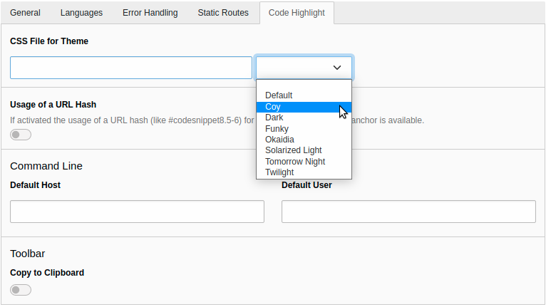

.. include:: ../Includes.txt

.. _configuration:

=============
Configuration
=============

Target group: **Developers, Integrators**

Site configuration
==================

A theme can be selected for a web site in the site configuration. Select a site under *Site Management* > *Sites*
and switch to the tab "Code Highlight":

   Selecting a theme in the Site Configuration

In the value picker you have the choice between several themes. As the extension uses `Prism <https://prismjs.com/>`__ for the code
highlighting you can have a look at there website to see the differences between the themes.

When selecting a theme, the path to the according CSS file is stored in the site configuration. So you can also
use an own theme to customise the look of the code snippets.

As the theme is assigned to a site, different sites can have different themes.

.. _configuration-template:

Changing the template
=====================

The template for the frontend output is delivered in the extension under the path
:file:`Resources/Private/Templates/CodeSnippet.html`. If you want to change it you can make a copy of it and adjust
the Fluid root paths. This can be done in the Constant Editor of the Template module:

.. figure:: ../Images/Configuration/constant-editor.png
   :class: with-shadow
   :alt: Constant Editor

   Constant Editor

Select the category "Codehighlight" and make the adjustments to the paths.

Alternatively you can change the paths directly in TypoScript:

.. code-block:: typoscript

   tt_content.tx_codehighlight_codesnippet {
      templateRootPaths {
         10 = EXT:your_sitepackage/Resources/Private/Templates/Codehighlight/
      }
      partialRootPaths {
         # Only needed if you want to use partials
         10 = EXT:your_sitepackage/Resources/Private/Partials/Codehighlight/
      }
      layoutRootPaths {
         # Only needed if you want to use layouts
         10 = EXT:your_sitepackage/Resources/Private/Layouts/Codehighlight/
      }
   }

.. _configuration-assets-embedding:

Assets embedding
================

The required CSS and JavaScript files from the Prism library are embedded with the :php:`PageRenderer` methods
:php:`addCssFile()` and :php:`addJsFooterFile()`. This means, that they adhere to the configuration setting
:php:`$GLOBALS['TYPO3_CONF_VARS']['FE']['versionNumberInFilename']` and the TypoScript setting
:ref:`config.concatenateJs <t3tsref:setup-config-concatenatejs>`.
