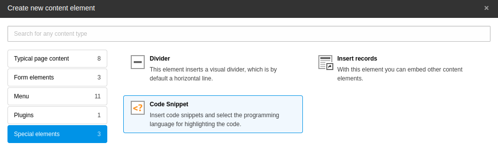
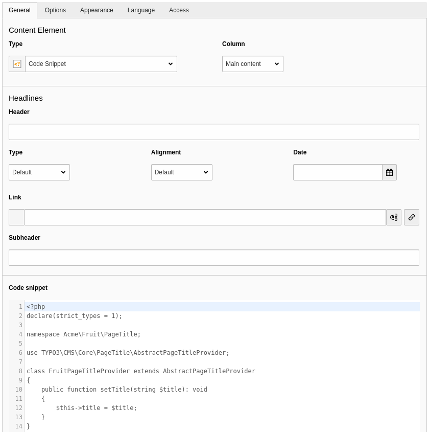
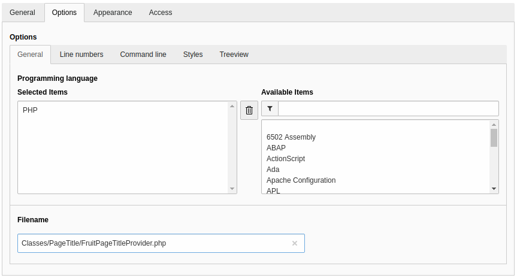
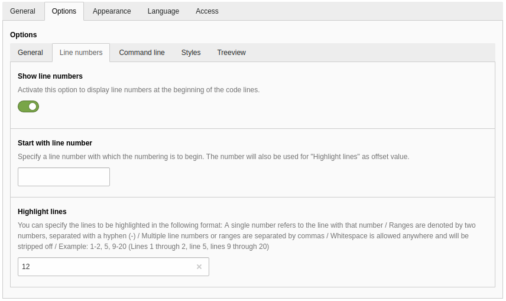
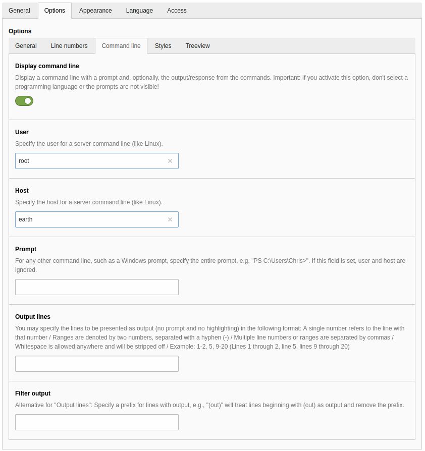

.. include:: ../Includes.txt

.. _for-editors:

===========
For Editors
===========

Target group: **Editors**

.. _editors-content-element:

Using the content element
=========================

The extension is shipped with a content element "Code Snippet". You'll find it in the content element wizard
under the "Special elements" tab:

   "Code Snippet" content element in the content element wizard

Selecting it creates a new content element.

.. _editors-content-element-general:

General
-------

In the "General" tab insert the code snippet into the according field:

   The "General" tab of the content element

.. _editors-content-element-options:

Options
-------

Here you'll find some settings to tune the visual representation of the code snippet. First of all you can select the
programming language - dependent on the language the snippet is formatted:

   Selecting the programming language

Make usage of the filter on the right side of the select box to find the needed programming language. You can only
select one language at a time. Leave it empty if the language you want is not available or you don't want syntax
highlighting.

.. _editors-content-element-options-line-numbers:

Line numbers
~~~~~~~~~~~~

Sometimes it is desirable to add line numbers, start them at a different number than 1 or highlight one or more lines
to point out something important. You can adjust these settings under the "Line numbers" tab of the options:

   Options for showing and adjusting line numbers

.. t3-field-list-table::
 :header-rows: 1

 - :Field:
         Field
   :Description:
         Description
 - :Field:
         Show line numbers
   :Description:
         Activate this option to display line numbers at the beginning of the each code line.
 - :Field:
         Start with line number
   :Description:
         Specify a line number with which the numbering is to begin.
         The entered number will also be used for "Highlight lines" as offset value.
 - :Field:
         Highlight lines
   :Description:
         You can specify the lines to be highlighted in the following simple format:

         - A single number refers to the line with that number
         - Ranges are denoted by two numbers, separated with a hyphen (-)
         - Multiple line numbers or ranges are separated by commas
         - Whitespace is allowed anywhere and will be stripped off

         **Example:** ``1-2, 5, 9-20`` (Lines 1 through 2, line 5, lines 9 through 20)

         When using an offset in the field "Start with line number" the lines must be adjusted accordingly.

.. _editors-content-element-options-command-line:

Command line
~~~~~~~~~~~~

.. figure:: ../Images/Introduction/example-shell.png
   :class: with-shadow
   :alt: Shell command with prompt

To visualise the commands on a console you can activate the "Display command line" switch. A prompt will be shown before
a code line.

   Options for a command line snippet

.. t3-field-list-table::
 :header-rows: 1

 - :Field:
         Field
   :Description:
         Description
 - :Field:
         Display command line
   :Description:
         Display a command line with a prompt and, optionally, the output/response from the commands.

         **Important:** If you activate this option, don't select a programming language or the prompts are not visible!
 - :Field:
         User
   :Description:
         Specify the user for a server command line (like Linux).
         The resulting prompt displays a ``#`` for the root user and ``$`` for all other users.

         *Default value:* ``user``
 - :Field:
         Host
   :Description:
         Specify the host for a server command line (like Linux).

         *Default value:* ``localhost``
 - :Field:
         Prompt
   :Description:
         For any other command line, such as a Windows prompt, specify the entire prompt, e.g. ``PS C:\Users\Chris>``.
         If this field is set, the values in the fields "User" and "Host" are ignored.
 - :Field:
         Output lines
   :Description:
         You may specify the lines to be presented as output (no prompt and no highlighting) in the following
         simple format:

         - A single number refers to the line with that number
         - Ranges are denoted by two numbers, separated with a hyphen (-)
         - Multiple line numbers or ranges are separated by commas
         - Whitespace is allowed anywhere and will be stripped off

         **Example:** ``1-2, 5, 9-20`` (Lines 1 through 2, line 5, lines 9 through 20)
 - :Field:
         Filter output
   :Description:
         Alternative for "Output lines": Specify a prefix for lines with output, e.g., ``(out)`` will treat lines
         beginning with (out) as output and remove the prefix.

You can see some examples for the rendering of the command line on the
`plugin page <https://prismjs.com/plugins/command-line/>`__ of the Prism library.

.. _editors-content-element-access:

Access
------

On the access tab you'll find the default fields, like "Visibility of content element" or the publish dates.
