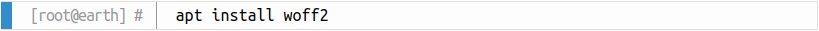

.. include:: ../Includes.txt

.. _maintenance:

===========
Maintenance
===========

This chapter is for developers who want to contribute and maintain the extension.

.. _screenshots:

Screenshots
===========

PHP code snippet
----------------

Example output using the Coy theme for a PHP code snippet with line numbers and line highlighting:

Shell command
-------------

Example output using the Coy theme for a shell command with prompt:

.. _release-management:

Release Management
==================

This extension uses `semantic versioning <https://semver.org/>`__ which basically means for you, that

- Bugfix updates (e.g. 1.0.0 => 1.0.1) just includes small bug fixes or security relevant stuff without breaking changes.
- Minor updates (e.g. 1.0.0 => 1.1.0) includes new features and smaller tasks without breaking changes.
- Major updates (e.g. 1.0.0 => 2.0.0) breaking changes which can be refactorings, features or bug fixes.
